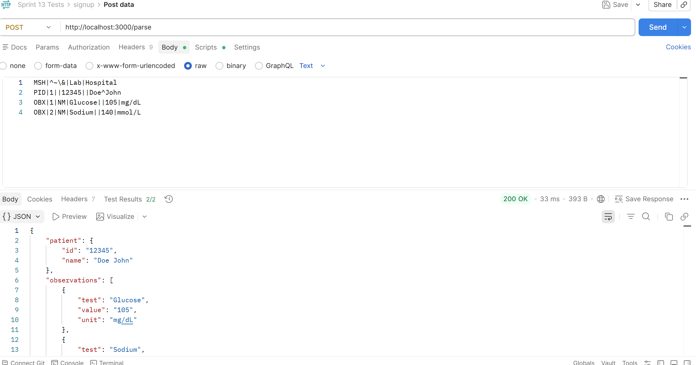
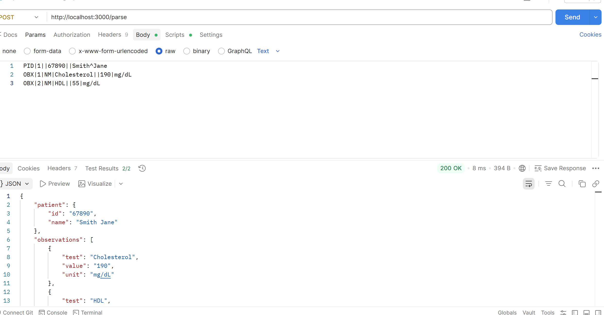
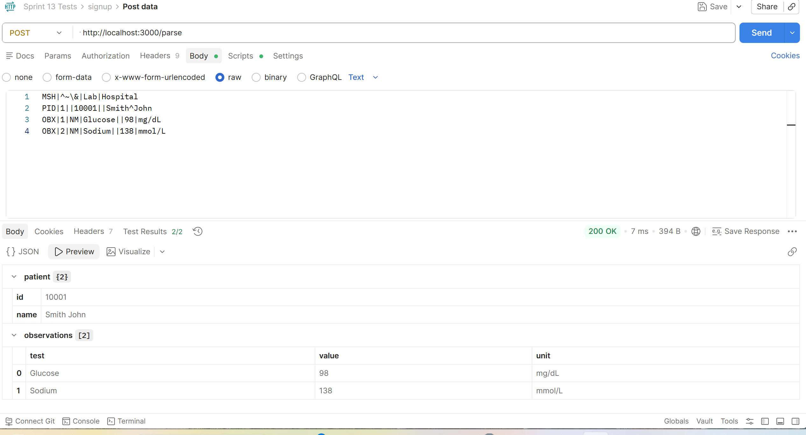
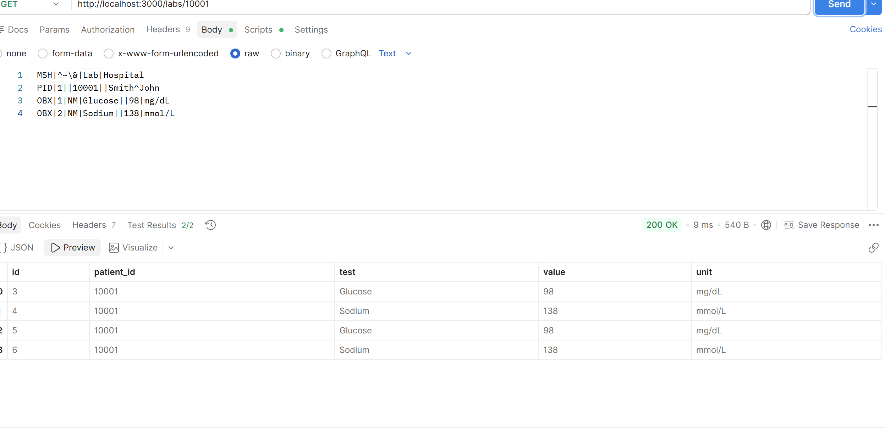
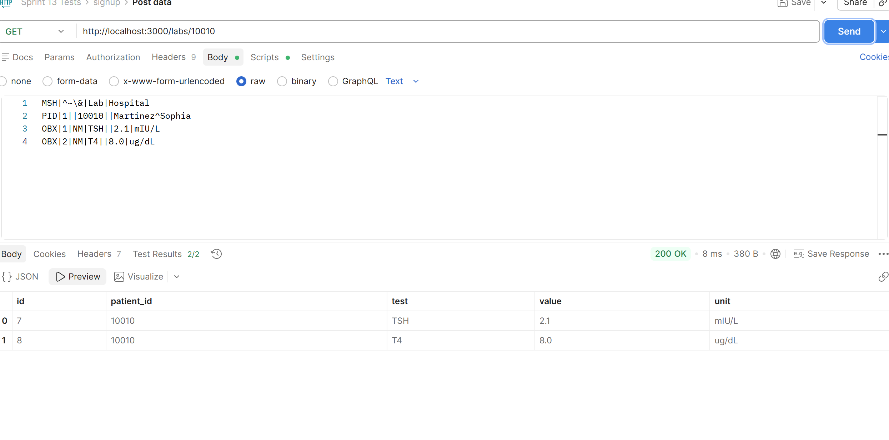

# HL7 Integration Parser API

Lightweight HL7 integration service built with Node.js and Express that ingests, validates, parses, and stores healthcare lab data. This project demonstrates real-world data pipeline patterns used in healthcare system integrations.

---

## 🚀 Features

- 📥 HL7 ingestion via HTTP POST endpoint  
- 🔍 Parsing HL7 messages into structured JSON  
- ✅ Validation of required segments (MSH, PID)  
- 🗃️ Persistent storage using SQLite  
- 🔎 Retrieval endpoint for patient lab data  
- 📝 Logging for request tracking and debugging  
- ⚠️ Basic error handling and invalid message rejection  

---

## 🧠 Architecture Overview
HL7 Message (text)
↓
Middleware (express.text)
↓
Parser (HL7 → JSON)
↓
Validation
↓
Database (SQLite)
↓
API Response (JSON)


---

## 🛠️ Tech Stack

- Node.js  
- Express  
- SQLite  
- JavaScript (ES6)  

---

## 📦 Installation

```bash
git clone https://github.com/bluestem16173/hl7-integration-parser.git
cd hl7-integration-parser
npm install   


Demonstrates full ingestion, persistence, and retrieval of HL7-based lab data.
